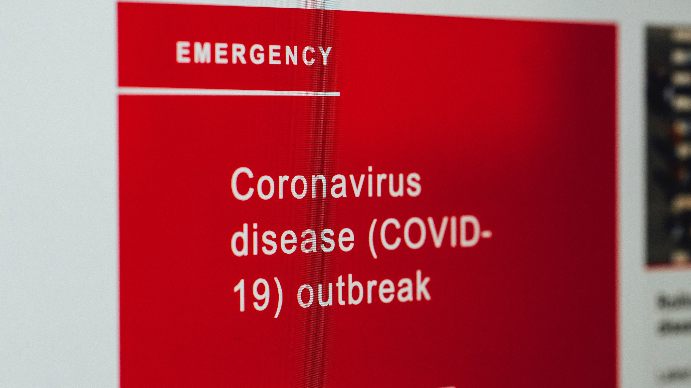

# Descriptive Analysis of COVID-19 Cases and Vaccination Rollout in the Philippines

## Introduction

In December 2019, an unidentified pneumonia outbreak was reported in Wuhan, Hubei Province, China. The World Health Organization declared a pandemic on March 12, 2020, due to the global spread of SARS-CoV-2 and thousands of deaths caused by coronavirus disease (COVID-19). To date, the world has paid a high price in terms of human lives lost, economic ramifications, and increased poverty as a result of this pandemic[^1].

In the Philippines, the first recorded case of COVID-19 was by a 38-year-old Chinese woman confined at San Lazaro Hospital. Ever since then, the daily cases of COVID-19 started to rise, with confirmed cases reaching almost 4,000,000 cumulative cases and causing a total of 59,030 deaths as of March 29, 2022[^2][^3]. Ever since the lockdown was imposed on March 14, 2020, people have started to stay at their homes instead of going out, increasing their chances of getting the disease. Malls, churches, and schools have been closed. Few people can be seen on the street, and fewer cars travel around the city. The pandemic changed the lifestyle of the Filipinos and we're introduced to a *"new normal"*.

But in response to the pandemic, companies started to create a vaccine to help reduce the number of cases and deaths of people around the world due to COVID-19. Companies like Pfizer, Moderna, and AstraZeneca formulated vaccines and helped people around the world. As of now, 58.11 percent of the total population in our country has received their first and second doses. It is still far from the target of vaccinating at least 80% of the population[^4]. 

The goal of this analysis is to examine the current COVID-19 data in the Philippines as well as the vaccination status in our country. A dataset from [Our World in Data](https://ourworldindata.org/coronavirus/country/philippines) will be used to obtain all of the information required to analyze the current trend of daily COVID-19 cases as well as the vaccination rollout in our country. The data will be used to encourage some Filipinos who are still afraid of getting vaccinated to get vaccinated, as well as to provide an analysis of how getting vaccinated will help to reduce overall cases in the country.

## Problem Statement

Global pandemic has affected the lives of many people in these past years. It has been difficult for researchers to examine and observe the day-to-day progress of Covid-19 here in our country. These statistics plays a major role in fighting and helping people to ease their panics with much reliable sources of information. Collecting information from large hospitals is a crucial step and requires a thorough management of data. Distinguishing the suspected and confirmed Covid-19 cases are needed to be collected and stored in a standardized way. In addition to the health impact that Covid-19 has brought to many people’s lives, the newly formulated vaccines was mostly rejected by a lot of people because of their significant concerns and uncertainty among the branded vaccines. They have safety concerns and other personal beliefs that made them hesitant in accepting the Covid-19 vaccines. 

## Significance of the Proposed Project

It is common knowledge that the pandemic has massively affected the societal elements for the past 2 years. However, COVID-19 is still somehow in the circulation given how long it has been. The importance of this study is that there may be underlying implicative factors that help COVID-19 circulate that may arouse in descriptive analysis. The society has only resolved into brute-force solutions and medical agendas. Patterns and unobservable factors are what the researchers are aiming for. In light of solving the pandemic's occurrence, vaccinations has been a focal part at this stage. However, vaccinations are only encouraged and not forced. Fortunately, there are open data that is present now that researchers could use which is related to COVID-19 along with its present vaccinations. That is why the study of whether the vaccinations are working and how long before it takes for the whole population to get vaccinated.

## Methods

We, the researchers, need to conduct a survey among individuals in the Philippines aged 18 and above. Participants will be interviewed from various locations in the Philippines, as well as from varied age groups, socioeconomic backgrounds, and vaccination status and opinions. We were able to achieve maximum variation sampling, which seeks to capture as many different population situations as possible, as a result of this. The platforms we'll utilize are online, such as Google Forms, zoom or via phone call. Questions  about COVID-19, vaccines, and risk perceptions and behaviors were included in the interview guide. The interview will be digitally recorded, verbatim transcribed, and translated into Filipino or English. The research team examined linguistic and conceptual equivalence in the translated materials since they are native or fluent in English or Tagalog.

## Expected Output

The coronavirus outbreak has posed a threat to people's lives, but this has been mitigated by the availability of various vaccine brands. Vaccination, in addition to wearing face masks and maintaining physical distance, is a critical component in preventing the spread of the Covid-19 virus. Vaccination has made significant contributions to the reduction of the burden of various infectious and spread diseases. Vaccines were shown to prevent a large number of deaths and diseases around the world. Vaccines Spreading credible information to the public can easily persuade them to get vaccinated against Covid-19. A national vaccination day was observed by the government to recognize and appreciate the importance and necessity of getting vaccinated. Vaccination caravans would be organized to assist healthcare workers and the government in this regard.

#### References Used
[^1]: Ciotti, M., Ciccozzi, M., Terrinoni, A., Jiang, W. C., Wang, C. B., & Bernardini, S. (2020). The COVID-19 pandemic. Critical reviews in clinical laboratory sciences, 57(6), 365-388.
[^2]: https://en.wikipedia.org/wiki/COVID-19_pandemic_in_the_Philippines.
[^3]: https://www.worldometers.info/coronavirus/country/philippines/.
[^4]: https://www.rappler.com/newsbreak/data-documents/tracker-covid-19-vaccines-distribution-philippines/.
[^5] https://www.frontiersin.org/articles/10.3389/fpubh.2021.632914/full
[^6] https://www.indiatoday.in/information/story/national-vaccination-day-2022-date-history-significance-theme-and-quotes-1925909-2022-03-16
[^7] https://tools.niehs.nih.gov/wetp/index.cfm?id=2592
