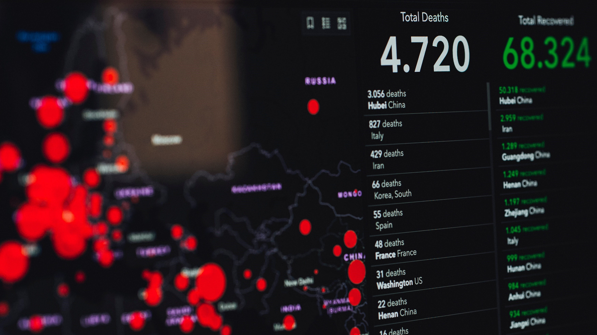
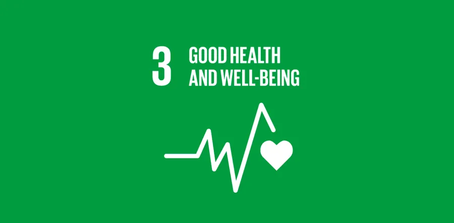

# Reaching New Heights : Boosting Vaccinations for a Safer Community

## Introduction

In December 2019, the world was rocked by an unidentified pneumonia outbreak. As the months passed, the total number of cases increased, and as a result of this pandemic, people died and our economy suffered.[^1].

The economic impact of COVID-19 is becoming more apparent as it spreads across borders. The travel industry like airlines and hotels are hit badly, and lot of events are cancelled. Supply chains are disrupted, trade links slowed down, and business travel has virtually ceased.[^9].

The first recorded case of COVID-19 in our country was of a woman experiencing the symptoms who became confined at San Lazaro Hospital. Since then, the number of daily cases of COVID-19 has increased, with confirmed cases reaching nearly 4,000,000 and causing 59,030 deaths as of March 29, 2022[^2][^3]. Since the lockdown was imposed on March 14, 2020, people have begun to stay at home rather than go out, increasing their chances of contracting the disease. Shopping malls, churches, and schools have all been closed. Fewer people can be seen on the streets, and fewer cars are seen driving around the city. 

According to Levin(2020)[^11], the virus presents risk especially for adults and the elderly. Meanwhile, infection is lower for the children and young adults, but it rises to 0.4 percent by age 55, 1.4 percent at 65, 4.6 percent at 75, 15 percent at 85, and lastly, it exceeds 25 percent for 90 and up. The same idea is proposed by Liu's 2020[^12] study, in which he stated that age was a part of the risk factors in the severity and mortality of diseases, despite the fact that the data on age in those studies is rough. However, it revealed that patients among 60 years old seemed to have higher percentage for acquiring respiratory failure and required longer treatments than patients under 60. It means that older patients are more severe and responds poorly to treatments. The cure rate over 60 (89.4 percent) was lower than that of patients under 60 (95.6 percent), particularly in males and those with respiratory failure. This indicates that the older a person becomes, the greater the risk of death when infected with COVID-19.

High risk groups such as people with comorbidities, women with high-risk pregnancies, and elderly 60 years and above, are most likely be exposed and be included in the probable and suspected cases of Covid-19. According to a survey conducted on 2020, Covid-19 cases usually came from the age group 32-61 and 46.4% of these are females and 68.8% resides in the National Capital Region[^16]. 

However, in response to the pandemic, companies began developing a vaccine to help reduce the number of cases and deaths caused by COVID-19 around the world. Vaccines were developed by companies such as Pfizer, Moderna, and AstraZeneca, which aided people all over the world. As of now, 58.11 percent of our country's total population has received their first and second doses. It is still a long way from reaching the goal of vaccinating at least 80% of the population[^4]. 

The Philippines had started administering Covid-19 vaccines last March 2021 and prioritized health care workers and elderly to be vaccinated first. A survey was conducted in the three geographical and administrative regions that contains 38% of the Philippines population and had the worst Covid-19 cases. The sample population includes young adults ages 18 – 30 that consumes 52.4%. Survey shows that 62.5% of the sample population has agreed and answered “Yes” in the question if they would have their Covid-19 vaccines here in the Philippines, and 37.4% said that they don’t want the vaccine. Mostly, people are concerned with their health condition in matter of administering the vaccines that is why they are hesitant and not confident with the vaccines[^17].

In terms of vaccinations, Pantazatos (2021)[^13] found that for 15-44 yrs old and 45-64 yrs old, the tendency is that defensive vaccine effects  disappear about 20 weeks after vaccination. After the 20th week, it is possible for vaccination to have an adverse effect. This proclivity rises from the week of vaccination around 18th week, when it's gone. It shows that adult vaccination has an indirect negative effect on mortality in children aged 0-14 within the first 18 weeks upon vaccination.

With third SDG in mind, the goal of this analysis is to examine the current COVID-19 data in the Philippines as well as the vaccination status in our country. A dataset from [Our World in Data](https://ourworldindata.org/coronavirus/country/philippines) will be used to obtain all of the information required to analyze the current trend of daily COVID-19 cases as well as the vaccination rollout in our country. The data will be used to encourage some Filipinos who are still afraid of getting vaccinated to get vaccinated, as well as to provide an analysis of how getting vaccinated will help to reduce overall cases in the country.

## Problem Statement

The global pandemic has affected the lives of many people in these past years. It has been difficult for researchers to examine and observe the day-to-day progress of Covid-19 here in our country. These statistics play a major role in fighting and helping people to ease their panic with reliable sources of information. Collecting information from large hospitals is a crucial step and requires thorough management of data. Distinguishing the suspected and confirmed Covid-19 cases are needed to be collected and stored in a standardized way. In addition to the health impact that COVID-19 has brought to many people’s lives, the newly formulated vaccines were mostly rejected by a lot of people because of their significant concerns and uncertainty among the branded vaccines. They have safety concerns and other personal beliefs that made them hesitant in accepting the Covid-19 vaccines. Vaccine willingness is determined by a combination of the virus's perceived risk and the vaccine's confidence and convenience [^14]. Increased perceived adverse effects raise the perceived risk of the vaccine, which may reduce the payoff of vaccination and reduce the likelihood of vaccination[^15].  Also, according to recent surveys, the country’s vaccination efforts slowed down since COVID-19 alert level statuses were downgraded.[^10].

## Significance of the Proposed Project

It is common knowledge that the pandemic has massively affected the societal elements for the past 2 years. However, COVID-19 is still somehow in the circulation given how long it has been. The importance of this study is that there may be underlying implicative factors that help COVID-19 circulate that may arouse in descriptive analysis. The society has only resolved into brute-force solutions and medical agendas. Patterns and unobservable factors are what the researchers are aiming for. In light of solving the pandemic's occurrence, vaccinations has been a focal part at this stage. However, vaccinations are only encouraged and not forced. Fortunately, there are open data that is present now that researchers could use which is related to COVID-19 along with its present vaccinations. That is why the study of whether the vaccinations are working and how long before it takes for the whole population to get vaccinated.

To the community, the study will be beneficial to the community to further stop the spread of the COVID-19 Virus. Also, to raise awareness regarding the vaccination status of the country and to encourage unvaccinated individuals to muster up their courage and get vaccinated as soon as possible to help the government reach their target mark.

To the government, the study will be beneficial to the government in helping them to reach the target percentage of vaccinated individuals in our country.

## Methods

The main issue to be tackled in this project is the number of vaccinated individuals not yet reaching the target percentage from the government. We, the researchers, will conduct data analysis on the datasets about the current situation of COVID-19 and the current vaccination status of individuals in our country. The process of cleaning, transforming, and modeling data to uncover patterns for business decisions is also known as data analysis. Its goal is to extract essential information from data and use that information to make a decision[^8]. Also, by using the datasets, we can compare the different vaccination rates from each country, etc. We, the researchers, can also conduct a survey among individuals in the Philippines aged 18 and above. Participants will be interviewed from various locations in the Philippines, as well as from varied age groups, socioeconomic backgrounds, and vaccination statuses. We will be able to achieve maximum variation sampling, which seeks to capture as many different population situations as possible, as a result of this. The platforms we'll utilize are online, such as Google Forms, zoom, or via phone call. Questions about COVID-19, vaccines, and risk perceptions and behaviors were included in the interview guide. The interview will be digitally recorded, verbatim transcribed and translated into Filipino or English. The research team examined linguistic and conceptual equivalence in the translated materials since they are native or fluent in English or Tagalog. Once the data has been analyzed, it can now assist the researchers to create plans and develop ideas to help the government reach the target percentage.

## Expected Output

The coronavirus outbreak has posed a threat to people's lives, but this has been mitigated by the availability of various vaccine brands. Vaccination, in addition to wearing face masks and maintaining physical distance, is a critical component in preventing COVID-19 spread[^5]. Vaccinations made significant contributions for reducing the burden of various infectious and spread diseases. Vaccines were shown to prevent a large number of deaths and diseases around the world. And spreading credible information to the public can easily persuade them to get vaccinated against Covid-19. This research plans to produce a data analysis regarding the current COVID-19 situation in our country. Datasets from [Our World in Data](https://ourworldindata.org/coronavirus/country/philippines) will be used in order to get all the important information. The data will then be used to further persuade the unvaccinated individuals to get their vaccinations. A national vaccination day was already observed by the government to recognize and appreciate the importance and necessity of getting vaccinated[^6]. In addition to this, vaccination caravans can be organized to assist healthcare workers and the government in this regard. Also, planning of having a seminar in each barangay or city can be done if there is a large amount of individuals not yet vaccinated[^7].

## Contributors

Abacan, John Ronan ( ITBA 3207)

Balitaan, Virginia Flor ( ITBA 3206) 

Llabres, Mary Joyce O. ( ITBA 3206)

Molino, Jeanela Myca H. ( ITBA 3206)

Ramos, Jax Blaire Kristoffer B. ( ITBA 3206)

## Video Presentation

Click the attached Google Drive link in order to access the live and recorded presentation of this analysis.

https://drive.google.com/drive/folders/1r7Y-TES_MCiDEj37xnstSUYcj5Of7f_7?usp=sharing

### References Used
[^1]: Ciotti, M., Ciccozzi, M., Terrinoni, A., Jiang, W. C., Wang, C. B., & Bernardini, S. (2020). The COVID-19 pandemic. Critical reviews in clinical laboratory sciences, 57(6), 365-388.
[^2]: https://en.wikipedia.org/wiki/COVID-19_pandemic_in_the_Philippines.
[^3]: https://www.worldometers.info/coronavirus/country/philippines/.
[^4]: https://www.rappler.com/newsbreak/data-documents/tracker-covid-19-vaccines-distribution-philippines/.
[^5]: https://www.frontiersin.org/articles/10.3389/fpubh.2021.632914/full
[^6]: https://www.indiatoday.in/information/story/national-vaccination-day-2022-date-history-significance-theme-and-quotes-1925909-2022-03-16
[^7]: https://tools.niehs.nih.gov/wetp/index.cfm?id=2592
[^8]: https://www.guru99.com/what-is-data-analysis.html#:~:text=What%20is%20Data%20Analysis%3F%20Data%20analysis%20is%20defined,taking%20the%20decision%20based%20upon%20the%20data%20analysis.
[^9]: https://www.esquiremag.ph/money/industry/economic-impact-philippines-a00304-20200309
[^10]: https://interaksyon.philstar.com/trends-spotlights/2022/04/04/214306/philippines-covid-19-vaccination-is-slowing-down-some-observations/
[^11]: Levin, Andrew T.; Hanage, William P.; Owusu-Boaitey, Nana; Cochran, Kensington B.; Walsh, Seamus P.; Meyerowitz-Katz, Gideon  (2020). Assessing the age specificity of infection fatality rates for COVID-19: systematic review, meta-analysis, and public policy implications. European Journal of Epidemiology, 35(12), 1123–1138.
[^12]: Liu, Y., Mao, B., Liang, S., Yang, J., Lu, H., Chai, Y., … Xu, J. (2020). Association Between Ages and Clinical Characteristics and Outcomes of Coronavirus Disease 2019. European Respiratory Journal, 2001112. doi:10.1183/13993003.01112-2020 
[^13]: Pantazatos, S., & Seligmann, H. (2021). COVID vaccination and age-stratified all-cause mortality risk. Media. ellinkahoaxes. gr.
[^14]: Baumgaertner, B.; Ridenhour, B.J.; Justwan, F.; Carlisle, J.E.; Miller, C.R. Risk of disease and willingness to vaccinate in the United States: A population-based survey. PLoS Med. 2020, 17, e1003354.
[^15]: Kreps, S. E., Goldfarb, J. L., Brownstein, J. S., & Kriner, D. L. (2021). The Relationship between US Adults’ Misconceptions about COVID-19 Vaccines and Vaccination Preferences. Vaccines, 9(8), 901.
[^16]: Haw, N., Uy, J., Sy, K., & Abrigo, M. (2020). Epidemiological profile and transmission dynamics of COVID-19 in the Philippines. Epidemiology and Infection, 148, E204. doi:10.1017/S0950268820002137
[^17]: Caple, A., Dimaano, A., Sagolili, M. M., et al. (2021) Interrogating COVID-19 Vaccine Hesitancy in the Philippines. doi: https://doi.org/10.1101/2021.09.11.21263428
